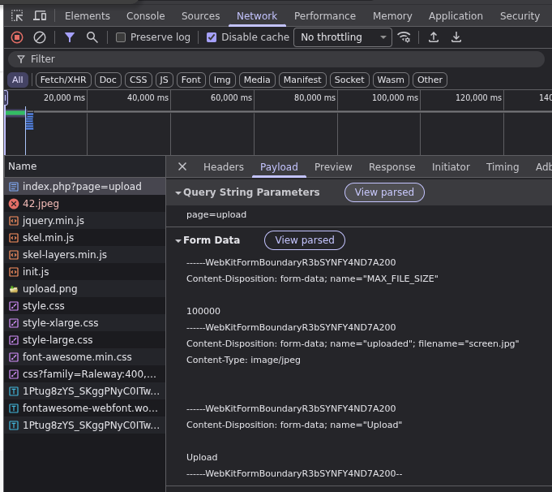

```http://localhost:8080/index.php?page=upload```
# reconnaissance de la cible
on peut observer que quand j'essaye d'upload un .jpg ca fonctionne comme ca devrait. par contre le site interdit d'upload un png pour certainnes raison.

# bypass de la restriction
on va tester avec un script python si cette restriction est client side ou server side.
on peut voir a quoi ressemble la requette dans l'outil de dev tool 
maintenant on peut recree la requette en python et la modifie legerement. 

si on cherche a upload une image en .png mais qu'on modifie le mimtype `image/png` en `image/jpeg` et qu'on lance le script  on obtient un flag.